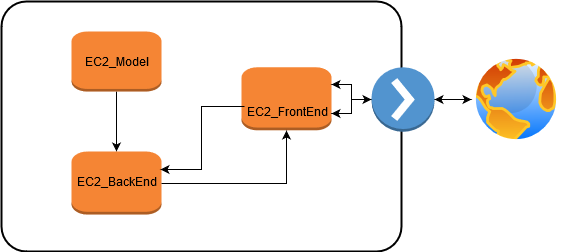
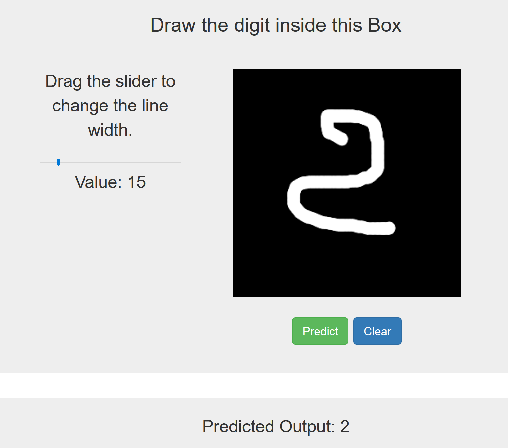

# Architecture of modelTraining Server - BackEnd Server and FrontEnd Web Server 

Launch a neuronal network model using BackEnd server and FrontEnd Web server
EC2, CNN, MNIST, Keras, Tensorflow 

## Infrastructure 

- EC2_model will train and stores the model : AMI Ubuntu 18.04 t3.x5large
- EC_BackEnd will use the saved model from EC2_model, treat the requests from EC2_FrontEnd and send back the response to EC2_FrontEnd
- EC2_FrontEnd is a Apache2 web server 
- To make simple, all the EC2 are connected to the pubic subnet 
- Inbound security group is defined as follows:
  - Port 22 for SSH
  - Port 8888 for Jupyter notebook (training model)
  - Port 80 for HTTP
  - Port 5000 for flask (connection FrontEnd and BackEnd)
  
## Results 

